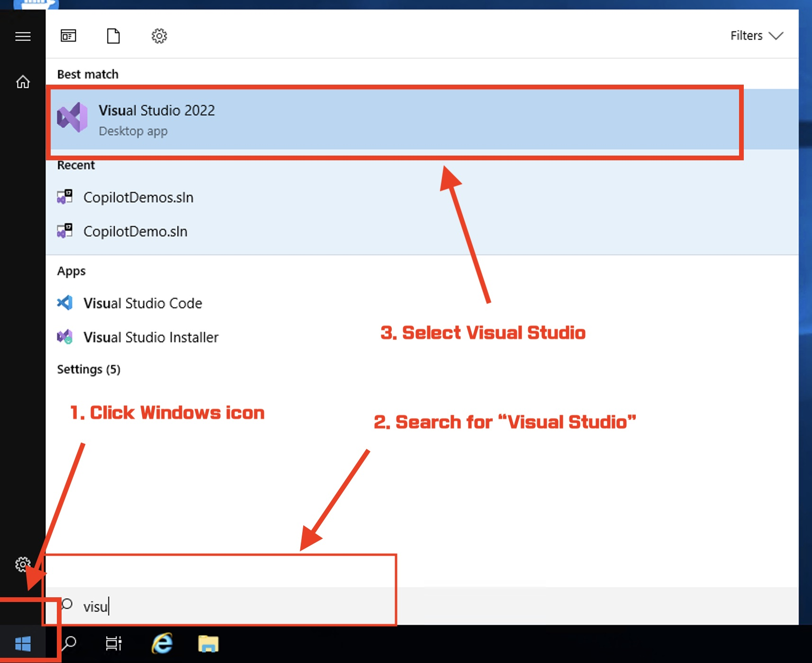
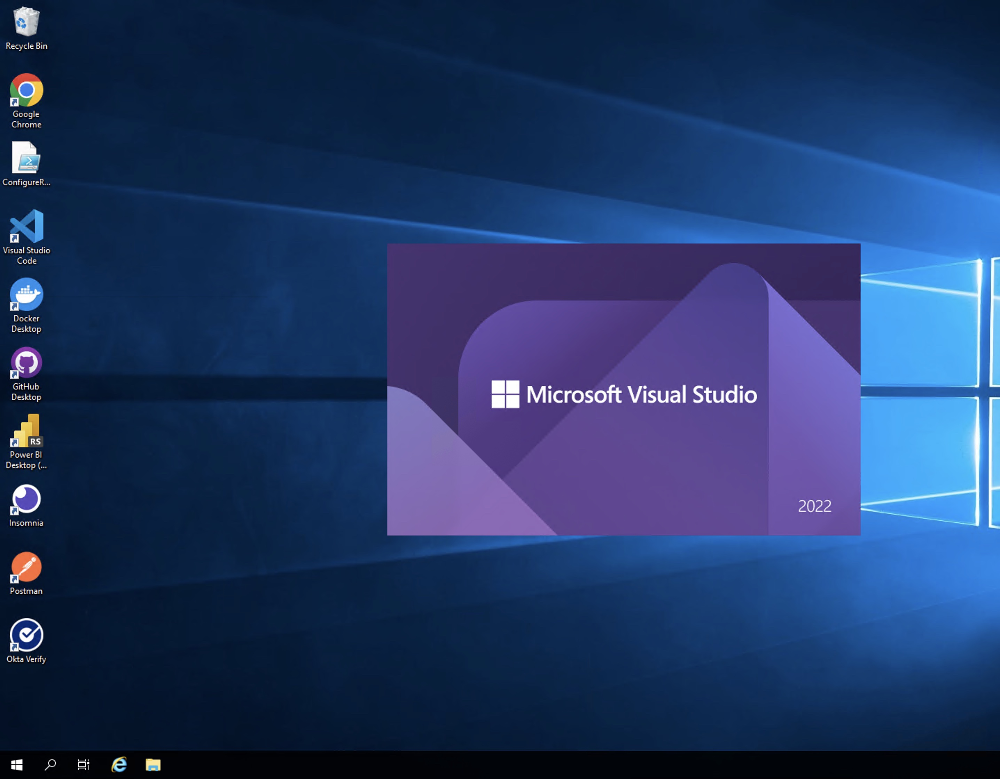
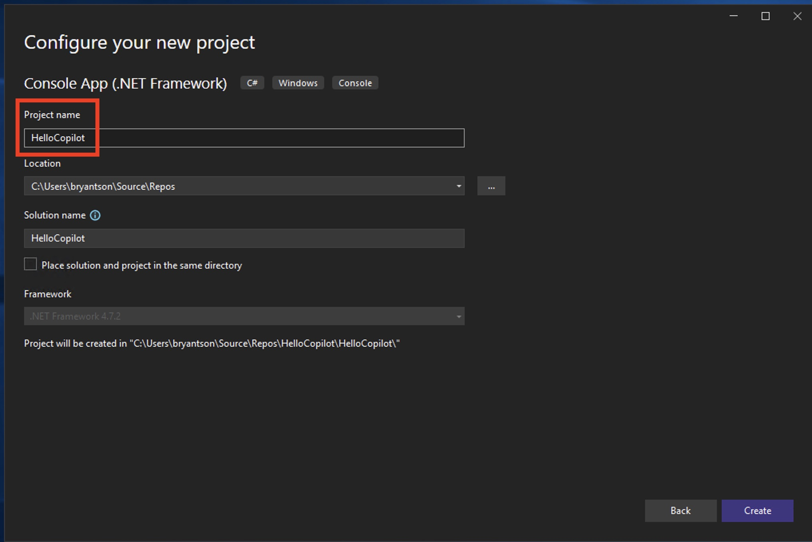
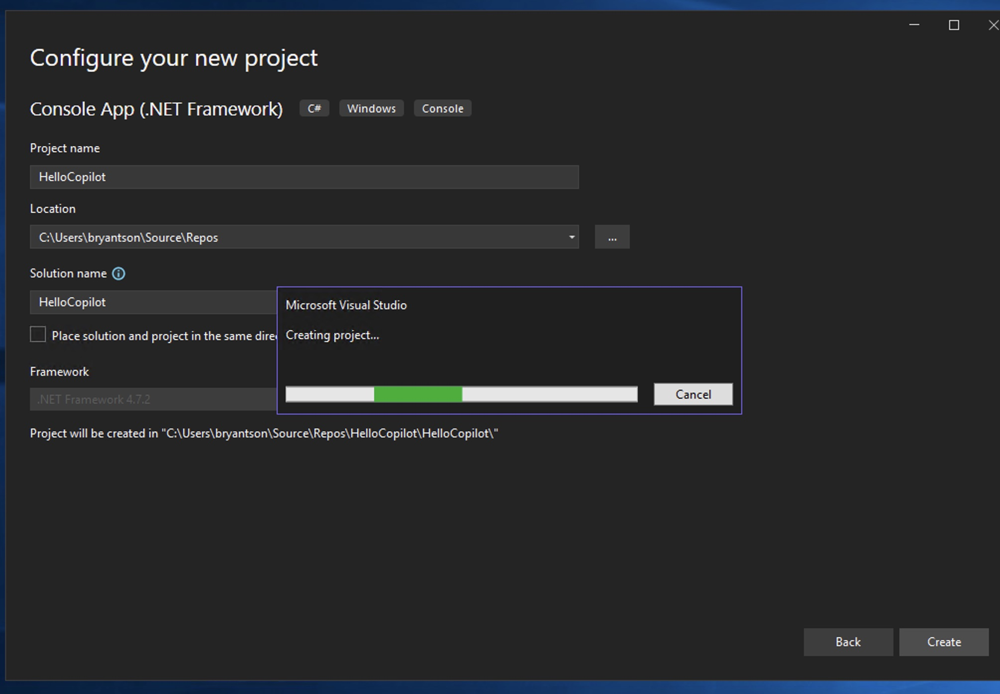
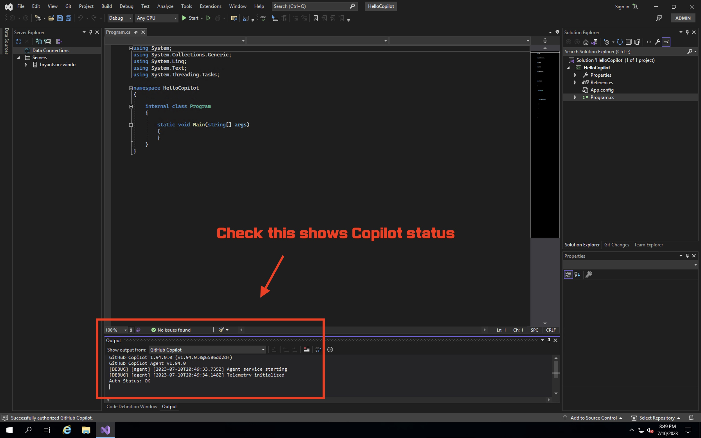
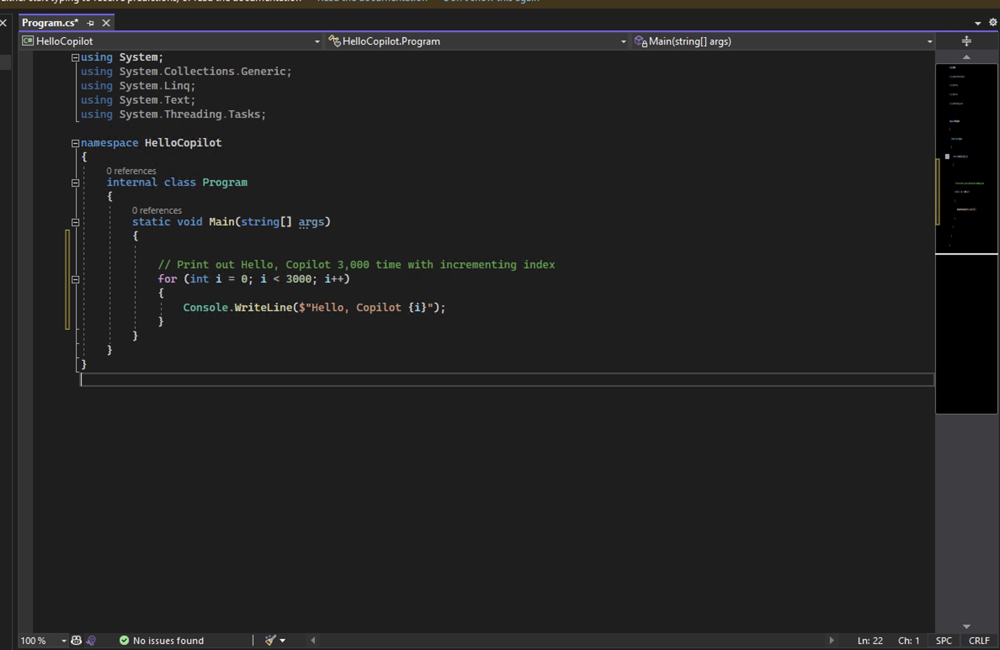
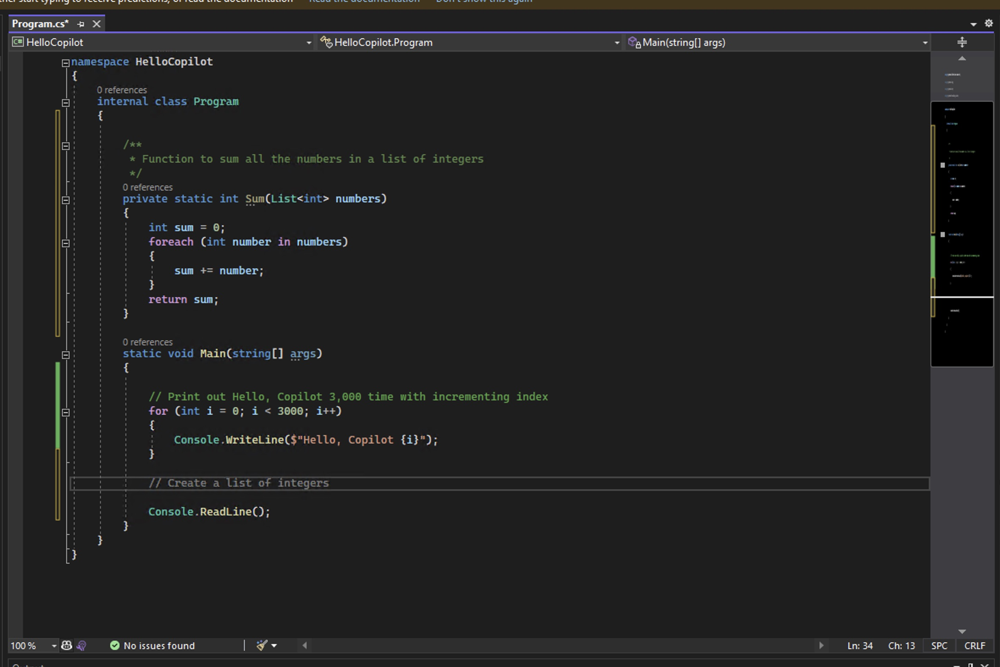
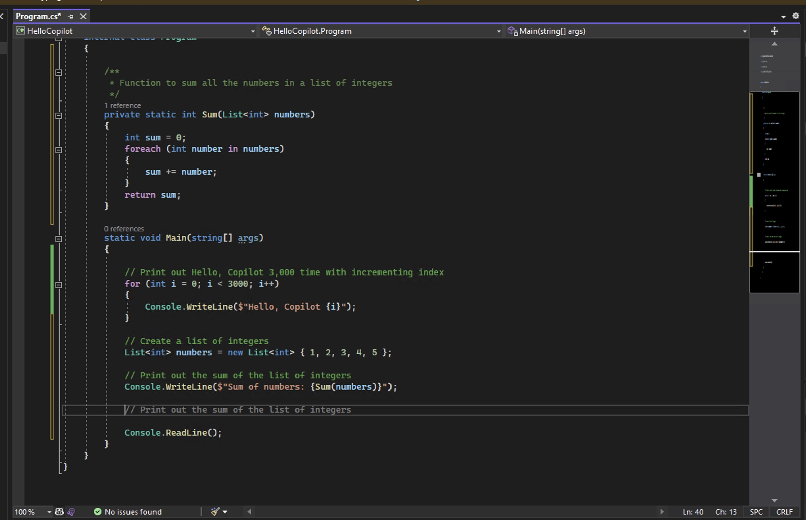
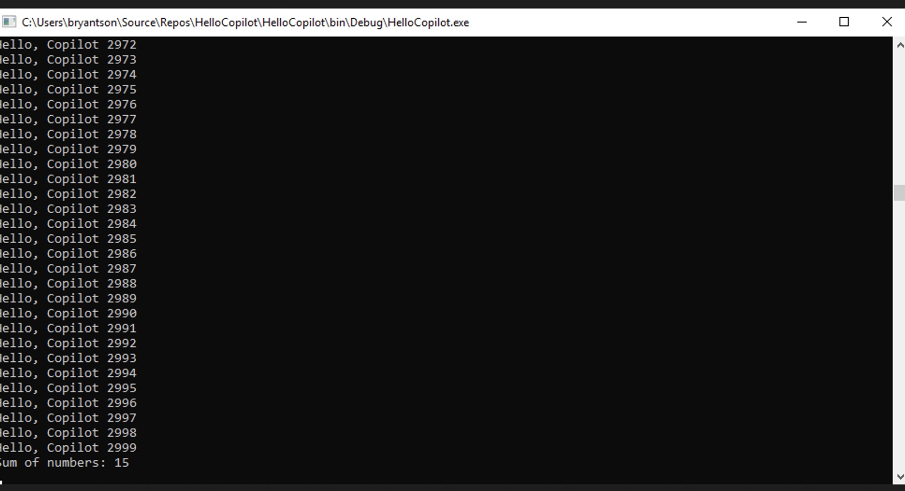
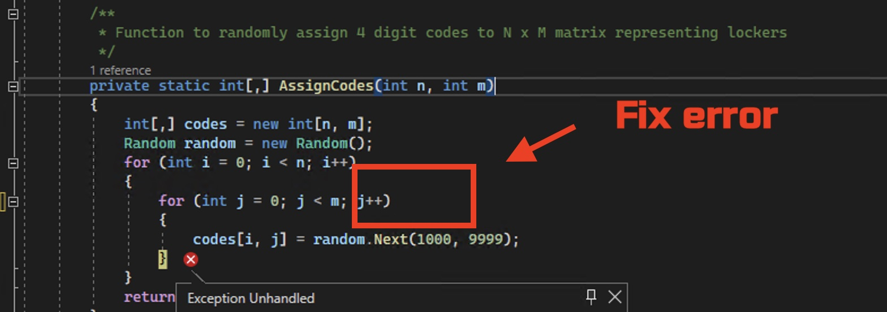

# Getting started - Visual Studio IDE

Welcome to GitHub Copilot! In this example, we'll show you how to use Copilot to write a simple .NET application.

## Prerequisites

Make sure that you meet the following requirements.

- [Visual Studio IDE](https://visualstudio.microsoft.com/downloads/) for Windows
- [Copilot Extension for Visual Studio IDE](https://marketplace.visualstudio.com/items?itemName=GitHub.copilot). 

[See this documentation on how to install Copilot extension for Visual Studio IDE](./CopilotExtensionVS)

## Steps

Please follow this step-by-step guide to get started with Copilot in Visual Studio IDE.

### Step 1: Launch Visual Studio IDE

Make sure that you followed all prerequisites and installed Visual Studio IDE and Copilot extension for Visual Studio IDE.

Search for **Visual Studio** after clicking Windows button.



Then, your Visual Studio IDE will be launching.



### Step 2: Create a new project

Once Visual Studio IDE is launched, you will see the following screen. Although you can use an existig project, let's try to create a new project by selecting **Create a new project**.


Then, you will see different options. Select **Console App (.NET Framework)** and click **Next**.


Then, you will see the following screen. Enter **HelloCopilot** as the project name and click **Create**.



You will see a progress bar while Visual Studio IDE is creating a new project.



### Step 3: Check Copilot is enabled

Let's make sure that Copilot is enabled. On bottom, you should see **Auth Status: OK** under **Output** window. Make sure to select **GitHub Copilot** from the dropdown.



And you should also see a Copilot icon above the **Output** window.


### Step 4: Write a simple code

Let's start writing some simple code first. Inside your **Main** method, create a following comment after `//`

```csharp
// Print out Hello, Copilot 3,000 time with incrementing index
```


As soon as you enter next line, you should see that Copilot is suggesting you to write a code. 


Select the first suggestion by hitting **Tab** button.



By the way, since this is a Console App, it will be a good idea to add the following line at the end of your **Main** method.

```csharp
Console.ReadLine();
```

This can helps to keep the console window open after the program is finished.


Your file should look like this.


That is it for writing a very simple code using Copilot. We can run this code by clicking **Start** button on top, but let's actually write a function.

### Step 5: Write a function

We will add a function above the **Main** method. Let's add a following comment as a block comment.

```csharp
/*
 * Function to sum all the numbers in a list of integers
 */
```


Again, when you enter, it should show you a suggestion. Yours might look different frome mine, though.


Hit **Tab** button to select the first suggestion. Your code might look like this.


Let's proceed to add codes to run that within main function. In the Main method, start clicking anywhere and click **Enter** button to see suggestions made by Copilot.



You can keep hit **Enter** and **Tab** buttons to take suggestions, but make sure that you can stop once you are happy with the result or fix if needed.



### Step 6: Run the code

Now, let's run the code. Click **Start** button on top.


If there is a drop down, click **Start** again.


Then, you will a console window with the following output.



### Step 7: Add more complicated function

Let's add little more complicated function. Add a following comment as a block comment.

```csharp
/*
 * Function to randomly assign 4 digit codes to N x M matrix representing lockers
 */
```


Going back to Main function again, start hitting **Enter** and **Tab** buttons to take suggestions.


Sometime, you might need to enter more details result to correct.


Sometimes, you might encounter an error like this.


Although you may not get an exactly same result, this example has a problem with index because it was using `i` as an index for both `for` loops. Let's fix that by changing the second `for` loop to use `j` instead of `i`.



Remember. Copilot is not perfect, and it can make some dumb mistakes. You might need to fix the code to make it work. You are the main pilot, and Copilot is your assistance.

Your final result when you run the code again might look like this.


That is it! Congratulation on finishing your first exercise with Copilot. You can try to write more complicated code and see how Copilot can help you.